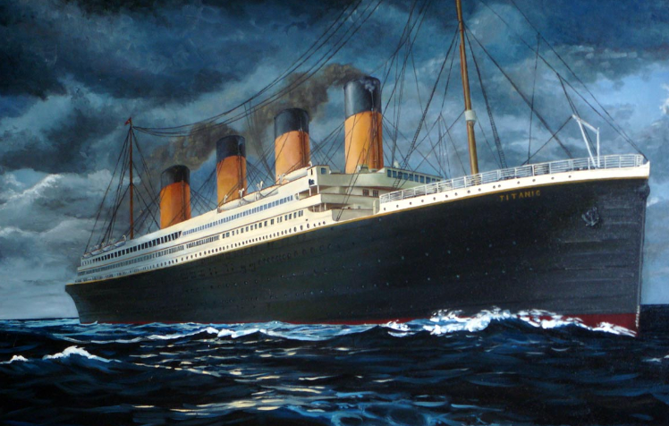

[Click Here](https://github.com/business-science/free_r_tips)"Free R tips from Business Science"


```{r setup, include=FALSE}
knitr::opts_chunk$set(echo = FALSE)
```

```{r,message=FALSE}
library(ggplot2)
library(shiny)
library(plotly)
data <- read.csv("tidydata.csv")
train <- data[1:891,]
factor_vars <- c("Survived","Pclass","SibSp","Parch","FamSize")
train[factor_vars] <- lapply(train[factor_vars], function(x) as.factor(x))
```


##### Survival in the Kaggle Titanic Training Data
  
```{r}
inputPanel(
shiny::selectInput("variable",
  label = "Predictor Variable", 
  choices = c("Sex","Pclass","SibSp",
  "Parch","Title","Embarked","FamSize",
  "FamSizeGroups", "TicketGroups","Miss_Cabin",
  "DeckGroups","Miss_Age"))) 
 ``` 
      

```{r}
output$plot <- renderPlotly({
  p <- ggplot(train) + 
    geom_bar(aes_string(x = input$variable, fill = train$Survived), 
  position = "dodge", color = "black") +
  scale_fill_brewer(type='qual', palette=6) +
            guides(fill=FALSE)+
            ggtitle(paste0("\n\nSurvival by ",input$variable, 
    " (n = 891)\nRed = Died, Blue = Survived"))
  ggplotly(p)
    })
    
  plotlyOutput("plot", height = "500px")
 ```